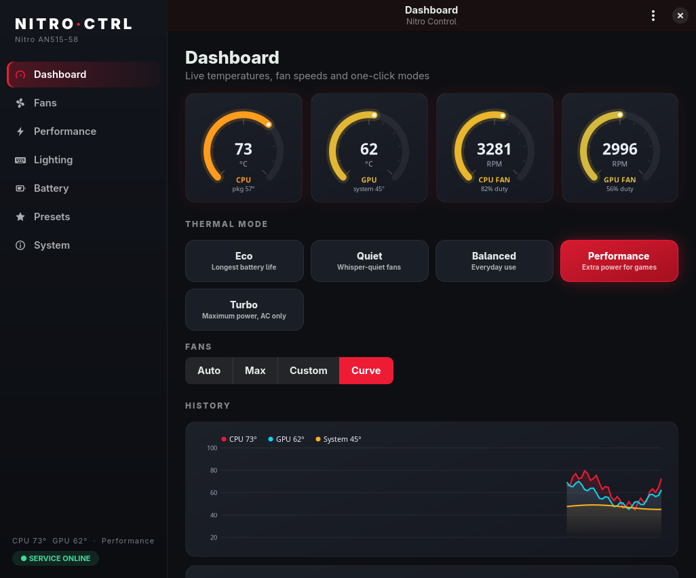
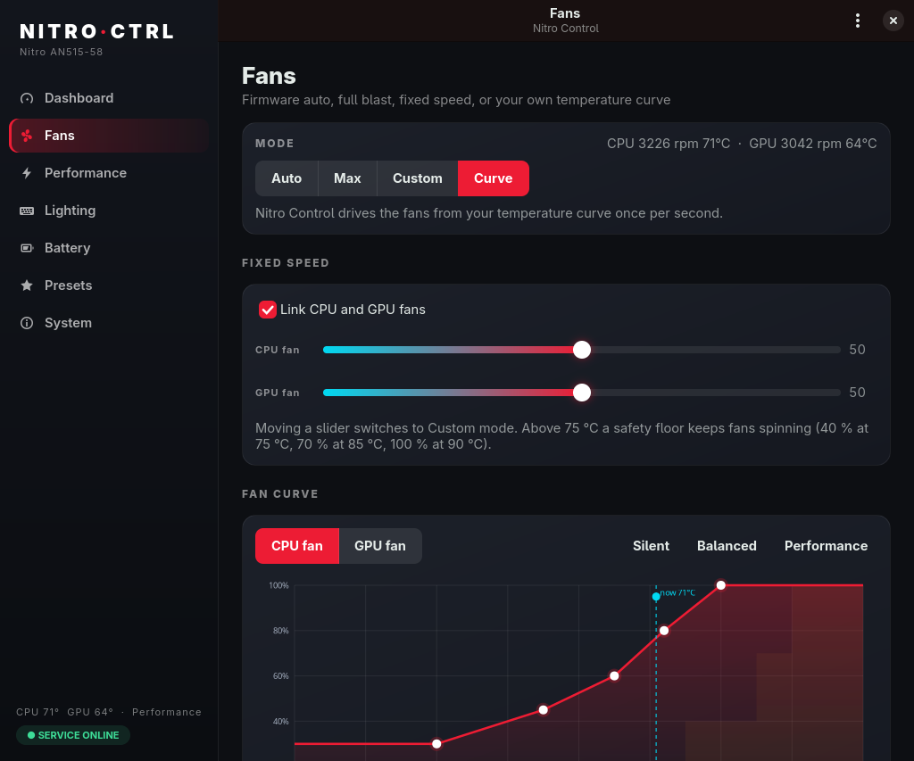
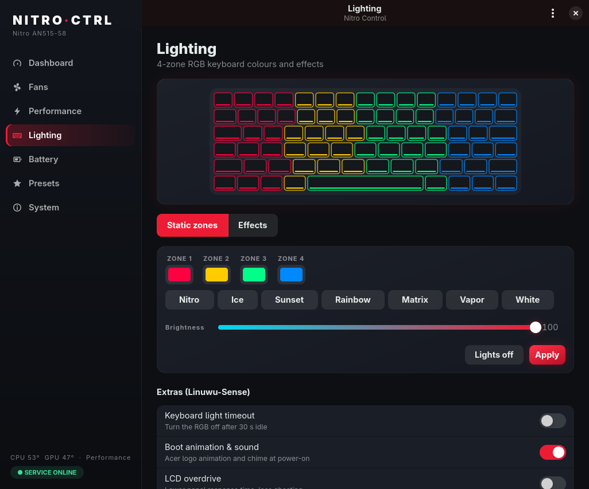
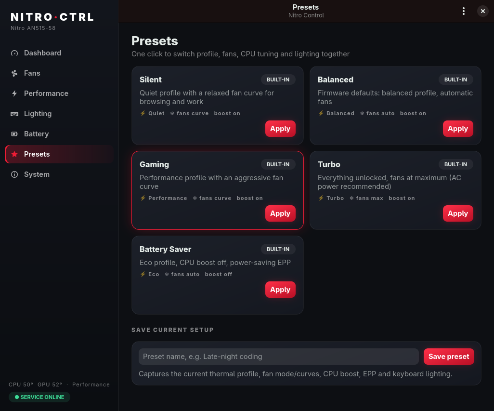
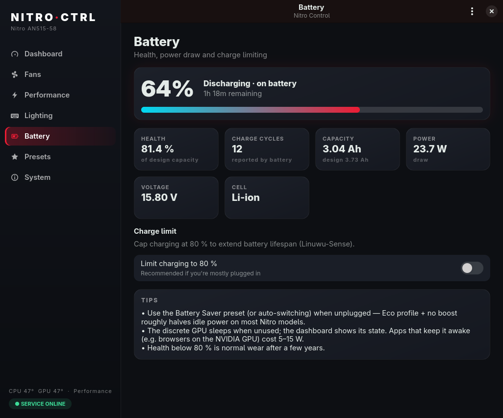

<div align="center">


# Nitro Control

**An open-source NitroSense alternative for Acer Nitro & Predator laptops on Linux, with extra features.**

Fan curves · thermal modes · 4-zone RGB · battery care · presets · auto-switching · CLI

Works on any distro (Arch, Debian/Ubuntu, Fedora, openSUSE, Void, Alpine, Gentoo, …) · systemd or OpenRC

</div>



---

## Why

On Windows, Acer ships **NitroSense** to control fans, performance modes and the keyboard backlight.
On Linux you get… nothing. Nitro Control fills that gap. It also does things NitroSense can't:
per-fan temperature curves, one-click presets, automatic switching when you plug in, a CLI for
scripts and keybinds, and safety failsafes around everything.

## Features

| | NitroSense (Windows) | **Nitro Control** |
|---|:---:|:---:|
| Live CPU / GPU / system temperatures & fan RPM | ✔ | ✔ with history graphs |
| Thermal modes (Eco / Quiet / Balanced / Performance / Turbo) | ✔ | ✔ |
| Fan modes: Auto / Max / Custom | ✔ | ✔ |
| **Custom fan curves** (drag-and-drop editor, per fan, hysteresis) | ✘ | ✔ |
| **Presets** (profile + fans + CPU + lighting in one click, save your own) | ✘ | ✔ |
| **Auto-switch** preset on AC ↔ battery | ✘ | ✔ |
| CPU turbo boost toggle, EPP, governor | ✘ | ✔ |
| 4-zone RGB: static colours & 8 effects, live preview, palettes | ✔ | ✔ ¹ |
| Battery health, cycles, power draw, time remaining | partial | ✔ |
| Battery charge limit | ✔ | ✔ ¹ ² |
| LCD overdrive, boot sound, power-off USB charging | ✔ | ✔ ¹ |
| dGPU sleep state (without waking it) | ✘ | ✔ |
| Command line + scripting (`nitroctl`) | ✘ | ✔ |
| Critical-temperature override & sensor-failure fallback | ✘ | ✔ |

¹ Needs the optional [Linuwu-Sense](https://github.com/0x7375646F/Linuwu-Sense) driver. `sudo ./install.sh --with-rgb` sets it up for you ([details](#rgb-keyboard-optional)).
² Or any kernel that exposes `charge_control_end_threshold` for your battery.

<table>
<tr><td></td><td></td></tr>
<tr><td></td><td></td></tr>
</table>

## Safe by design

Nitro Control does **not** poke the embedded controller directly. There are no raw EC writes, no
`/dev/port`, no `acpi_call`. It only uses documented kernel interfaces in `/sys`, so the kernel
driver checks every value before it reaches the firmware, and the firmware's own thermal protection
(CPU/GPU throttling, emergency shutdown) always stays active. On top of that:

- **Critical-temperature override:** in Custom/Curve mode, if the CPU reaches 95 °C or the GPU reaches 90 °C (adjustable), both fans go to 100 % until they cool 10 °C below that.
- **Safety floor:** whatever you set, fans never run slower than 40 % at 75 °C, 70 % at 85 °C, or 100 % at 90 °C.
- **Sensor watchdog:** if temperature readings stop for 3 seconds, the fans go back to the firmware.
- **Fail-safe stop:** when the service stops or crashes, systemd runs `nitro-controld --restore-auto`, which returns the fans to firmware control.
- **Monotonic curves:** a curve can never slow the fans down as the temperature rises. Speed drops gently, with 3 °C of hysteresis.
- **Resume-aware:** your settings are re-applied after suspend and after the firmware resets the fans (for example when you plug in the charger).
- **Validated everything:** only whitelisted files are ever written, only allowed values are accepted, and the state file is sanity-checked on load.
- **Least privilege:** the GUI and CLI run as your user. Only a small root service writes to hardware, and it's sandboxed with systemd hardening. Anyone can read sensors, but changing settings requires the `wheel`/`sudo`/`admin`/`nitro` group.
- **Battery friendly:** the monitor never wakes a sleeping NVIDIA GPU. `nvidia-smi` only runs when the dGPU is already awake *and* you're on AC.

## Supported hardware

Nitro Control detects what your kernel exposes and hides what it doesn't.

| Feature | Requirement |
|---|---|
| Temperatures, fan RPM | `acer_wmi` with hwmon support for your model (a recent kernel; models such as **AN515-58**, PH16-72, PT14-51) |
| Fan control (Auto/Max/Custom/Curve) | `acer_wmi` hwmon PWM (a recent kernel, if your model has the PWM quirk), **or** Linuwu-Sense |
| Thermal modes | ACPI platform profile (`acer_wmi`, most Nitro/Predator from ~2020) |
| RGB keyboard, charge limiter, extras | [Linuwu-Sense](https://github.com/0x7375646F/Linuwu-Sense) (optional) |
| CPU boost / EPP / governor | `intel_pstate` or `amd-pstate` / cpufreq (any laptop) |

Developed and tested on an **Acer Nitro AN515-58** (i7-12650H + RTX 3070 Ti) running kernel 7.2.
Other Nitro/Predator models should work to the extent their driver supports them. Please open an
issue with `nitroctl info` output for yours.

## Install

```sh
git clone https://github.com/thomasmartinoa/nitro-control.git
cd nitro-control
sudo ./install.sh
```

The installer:
1. Checks for Python 3.8+, PyGObject, GTK 4 and libadwaita, and offers to install them with your package manager (pacman, apt, dnf, zypper, xbps, apk, emerge, eopkg).
2. Copies everything to `/usr/local` (change this with `--prefix`).
3. Installs and starts the `nitro-controld` service (systemd or OpenRC).
4. Makes sure your user is allowed to change settings.

Then open **Nitro Control** from your app menu, or run `nitro-control`.

Uninstall with `sudo ./install.sh --uninstall`. Add `--purge` to also delete saved settings.

## RGB keyboard (optional)

The mainline kernel driver doesn't control the 4-zone RGB keyboard yet. The community
[Linuwu-Sense](https://github.com/0x7375646F/Linuwu-Sense) driver does. It also adds an 80 % charge
limiter, LCD overdrive, the boot animation/sound toggle and power-off USB charging. The installer asks
whether you want it (default: no), or you can run:

```sh
sudo ./install.sh --with-rgb                  # during install, or any time later
sudo sh packaging/linuwu/setup-rgb.sh status  # which driver is active
sudo sh packaging/linuwu/setup-rgb.sh remove  # back to stock acer_wmi
```

What the setup does, and why it's safe:

1. **Pinned and verified source.** It downloads one exact upstream commit and checks SHA-256 hashes of the source, the licence and the patched result. If anything doesn't match, it refuses to build.
2. **Patches.** Upstream doesn't build on Linux 7.x (`strncpy()` was removed), so the setup patches that. It also fixes two bugs that could crash the kernel when the module unloads (unchecked `filp_open()` error pointers, a double close) and an out-of-bounds read on empty writes. See [`patch_linuwu.py`](packaging/linuwu/patch_linuwu.py).
3. **DKMS.** The module is rebuilt automatically for every new kernel. Clang-built kernels like CachyOS are detected (`LLVM=1`).
4. **Safe switch.** The setup stops the service (fans go back to the firmware), unloads `acer_wmi` and loads Linuwu-Sense. If the new driver doesn't come up within a few seconds, everything is rolled back.
5. **Boot fallback.** Instead of blacklisting `acer_wmi`, a modprobe rule loads Linuwu-Sense in its place, and falls back to the stock `acer_wmi` if Linuwu-Sense isn't built for the running kernel. You never boot without a working Acer driver.

Requirements: Secure Boot off (or DKMS module signing set up), plus kernel headers and DKMS. The setup
offers to install those with your package manager.

> With Linuwu-Sense active, fan control goes through its `fan_speed` interface instead of hwmon PWM.
> Nitro Control handles both, including curves and all the safety features.

<details>
<summary>Manual dependencies</summary>

| Distro | Packages |
|---|---|
| Arch / Manjaro / CachyOS / EndeavourOS | `python-gobject python-cairo gtk4 libadwaita` |
| Debian 12+ / Ubuntu 22.04+ / Mint / Pop!_OS | `python3-gi python3-gi-cairo gir1.2-gtk-4.0 gir1.2-adw-1` |
| Fedora / Nobara | `python3-gobject python3-cairo gtk4 libadwaita` |
| openSUSE | `python3-gobject python3-gobject-cairo typelib-1_0-Gtk-4_0 typelib-1_0-Adw-1` |
| Void | `python3-gobject gtk4 libadwaita` |
| Alpine | `py3-gobject3 py3-cairo gtk4.0 libadwaita` |

The service and CLI need only Python 3. The GUI is optional.
</details>

<details>
<summary>Try it without installing</summary>

```sh
sudo python3 -m nitrocontrol.daemon &    # the service (Ctrl+C returns fans to auto)
python3 -m nitrocontrol                  # the GUI
python3 -m nitrocontrol.cli status       # the CLI
```
Without the service running, the GUI and CLI still show live readings in read-only mode.
</details>

## Command line

```sh
nitroctl                          # status
nitroctl watch                    # live status
nitroctl info                     # what your machine supports
nitroctl profile                  # list thermal modes
nitroctl profile turbo            # eco | quiet | balanced | performance | turbo | next
nitroctl fan auto                 # auto | max
nitroctl fan custom 60 70         # CPU 60 %, GPU 70 %
nitroctl curve both silent        # built-in curve: silent | balanced | performance
nitroctl curve cpu 40:20 60:45 75:70 85:100
nitroctl boost off                # CPU turbo boost
nitroctl battery-limit 80         # needs kernel/driver support
nitroctl rgb zones ff0040 ffcc00 00ff88 0088ff -b 80
nitroctl rgb effect wave -s 5 -d left
nitroctl rgb off
nitroctl preset list
nitroctl preset apply Gaming
nitroctl preset save "Late night"
```

Add `--json` for machine-readable output (handy for status bars like Waybar or Quickshell).

### Bind the Nitro key / shortcuts

Hyprland:
```ini
bind = , XF86Launch1, exec, nitro-control     # NitroSense key (the keysym varies by model)
bind = SUPER, F5, exec, nitroctl profile next # cycle thermal modes
```
Sway / i3: `bindsym XF86Launch1 exec nitro-control`. On GNOME/KDE, add a custom shortcut in Settings.

## How it works

```
 ┌──────────────┐   ┌──────────────┐
 │ nitro-control│   │   nitroctl   │      run as your user
 │   (GTK 4)    │   │    (CLI)     │
 └──────┬───────┘   └──────┬───────┘
        │ JSON over /run/nitro-control/nitro.sock (peer-credential checked)
 ┌──────▼──────────────────▼───────┐
 │         nitro-controld          │      root, sandboxed
 │  validation · fan curves ·      │
 │  safety override · presets ·    │
 │  AC/battery auto-switch         │
 └──────┬──────────────────────────┘
        │ sysfs only
 ┌──────▼──────────────────────────┐
 │ acer_wmi (hwmon, platform_profile)
 │ linuwu_sense (optional) · cpufreq · power_supply
 └─────────────────────────────────┘
```

Settings persist in `/var/lib/nitro-control/state.json` and are restored at boot.

## Development

```sh
python3 -m unittest discover -s tests -v   # runs against a simulated sysfs, never real hardware
```

Point everything at a fake tree to hack on the UI without root:
```sh
python3 -c "import sys; sys.path.insert(0,'tests'); import fakesys; fakesys.build('/tmp/fakesys', linuwu=True)"
export NITRO_SYSFS_ROOT=/tmp/fakesys NITRO_SOCKET=$XDG_RUNTIME_DIR/nc.sock
python3 -m nitrocontrol.daemon --socket $NITRO_SOCKET --state /tmp/nc-state.json &
python3 -m nitrocontrol
```

## Credits & disclaimer

- The fan, sensor and platform-profile support comes from the Linux `acer-wmi` driver and its maintainers.
- The optional RGB and extras come from [Linuwu-Sense](https://github.com/0x7375646F/Linuwu-Sense).

Nitro Control is an independent project. It is **not affiliated with or endorsed by Acer**. "Acer", "Nitro",
"Predator" and "NitroSense" are trademarks of Acer Inc. The software is provided under the MIT license,
without warranty. It relies on the firmware's own protections and adds its own, but you use it at your own risk.
